Analysing perceived risk in pedestrian-vehicle interaction by means of crowdsourcing
=======
This project defines a framework for the analysis of perceived risk in the interaction between pedestrian and vehicle, from the perspective of the driver using a crowdsourcing approach. The jsPsych framework is used to for the frontend. In the description below, it is assumed that the repo is stored in the folder crossing-crowdsourcing. Terminal commands lower assume macOS.

## Setup
Tested with Python 3.8.5. To setup the environment run these two commands in a parent folder of the downloaded repository (replace `/` with `\` and possibly add `--user` if on Windows:
- `pip install -e crossing-crowdsourcing` will setup the project as a package accessible in the environment.
- `pip install -r crossing-crowdsourcing/requirements.txt` will install required packages.

For QA, the API key of appen needs to be places in file `crossing-crowdsourcing/secret`. The file needs to be formatted as `crossing-crowdsourcing/secret example`.

## Implementation on heroku
We use [heroku](https://www.heroku.com/) to host the node.js implementation. The demo of the implementation may be viewed [here](https://crossing-crowdsourced.herokuapp.com/?debug=1&save_data=0). Implementation supports images and/or videos as stimuli.

## Measuring perceived risk
In this crowdsourcing survey, participants are watching 35 out of a total of 86 videos, that include interactions of a vehicle with pedestrian, from the perspective of the driver. During these videos, the participants are tasked with pressing the F key on their keyboard when they feel a situation could become risky. 

.

An example of one of the videos included in the crowdsourcing survey

### Filtering of heroku data
Data from heroku is filtered based on the following criteria:
1. People who made more than `config.allowed_mistakes_signs mistakes` in the meaning of traffic signs.
2. People of which the results had deviating video lengths in more than `config.allowed_stimuli_wrong_duration` of the time, or who had data on less than `config.num_stimuli_participant` videos available.

## Crowdsourcing job on appen
We use [appen](http://appen.com) to run a crowdsourcing job. You need to create a client account to be able to create a launch crowdsourcing job. Preview of the appen job used in this experiment is available [here](https://view.appen.io/channels/cf_internal/jobs/1730370/editor_preview?token=22UH3xH4x1hHZy2yVHntEg).

### Filtering of appen data
Data from appen is filtered based on the following criteria:
1. People who did not read instructions.
2. People who are younger than 18 years of age.
3. People who completed the study in under `config.allowed_min_time`.
4. People who completed the study from the same IP more than once (the 1st data entry is retained).
5. People who used the same `worker_code` multiple times. One of the disadvantages of crowdsourcing is having to deal with workers that accept and do crowdsourcing jobs just for money (i.e., `cheaters`). The framework offers filtering mechanisms to remove data from such people from the dataset used for the analysis. Cheaters can be reported from the `crossing.analysis.QA` class. It also rejects rows of data from cheaters in appen data and triggers appen to acquire more data to replace the filtered rows.

### Anonymisation of data
Data from appen is anonymised in the following way:
1. IP addresses are assigned to a mask starting from `0.0.0.0` and incrementing by 1 for each unique IP address (e.g., the 257th IP address would be masked as `0.0.0.256`).
2. IDs are anonymised by subtracting the given ID from `config.mask_id`.

## Analysis
Analysis can be started by running `python crossing-crowdsourcing/crossing/run.py`. A number of CSV files used for data processing are saved in `crossing-crowdsourcing/_output`. Visualisations of all data are saved in `crossing-crowdsourcing/_output/figures/`.

### Visualisation
All static figures below link to their corresponding dynamic and clickable versions in html format.

  
Visualisation of how dynamic variables (keypresses, objects, velocity) change over time.

#### Correlation and scatter matrices
  
Correlation matrix.

  
Scatter matrix.

#### Keypress data
[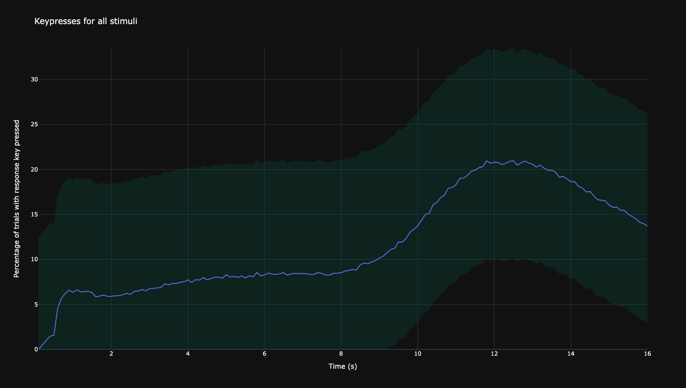](https://htmlpreview.github.io/?https://github.com/bazilinskyy/crossing-crowdsourcing/blob/main/figures/kp.html)  
Average keypresses for all videos.

[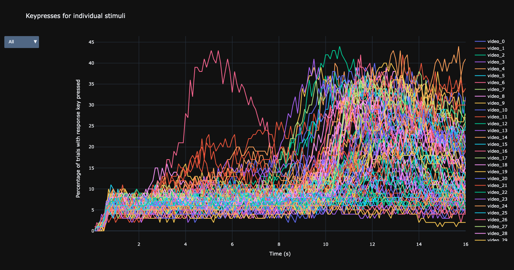](https://htmlpreview.github.io/?https://github.com/bazilinskyy/crossing-crowdsourcing/blob/main/figures/kp_videos.html)  
Individual keypresses for all videos.

[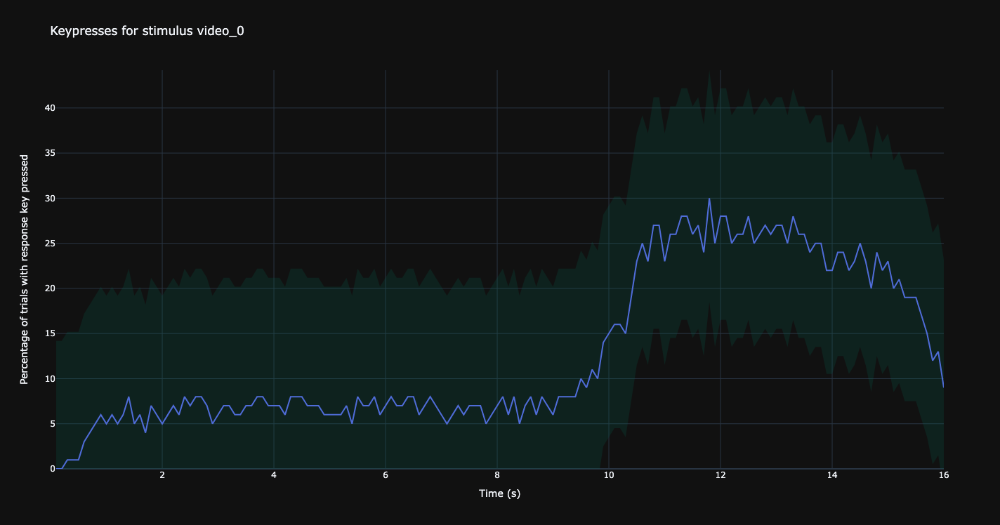](https://htmlpreview.github.io/?https://github.com/bazilinskyy/crossing-crowdsourcing/blob/main/figures/kp_video_0.html)  
Keypresses for a selected video (video_0).

[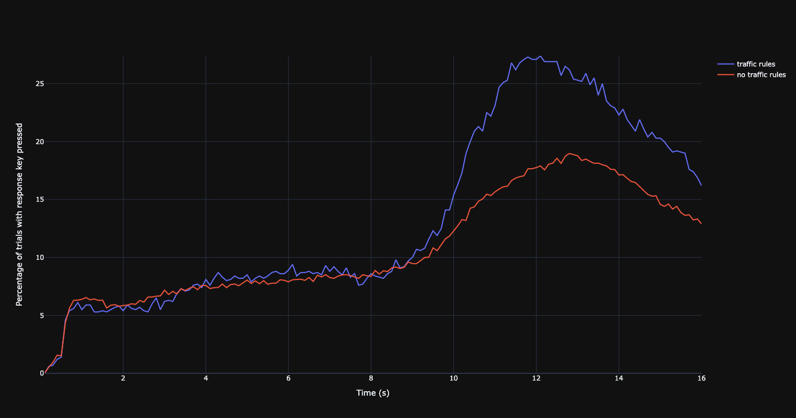](https://htmlpreview.github.io/?https://github.com/bazilinskyy/crossing-crowdsourcing/blob/main/figures/kp_and_traffic_rules.html)  
Keypresses in relation to traffic rules.

  
Keypresses in relation to the traffic signs.

[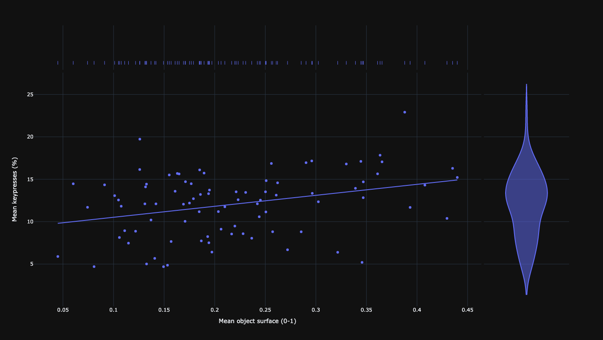](https://htmlpreview.github.io/?https://github.com/bazilinskyy/crossing-crowdsourcing/blob/main/figures/scatter_avg_obj_surface-avg_kp.html)  
Relationship between mean keypresses of participants and mean surface area of objects.

#### Communication
[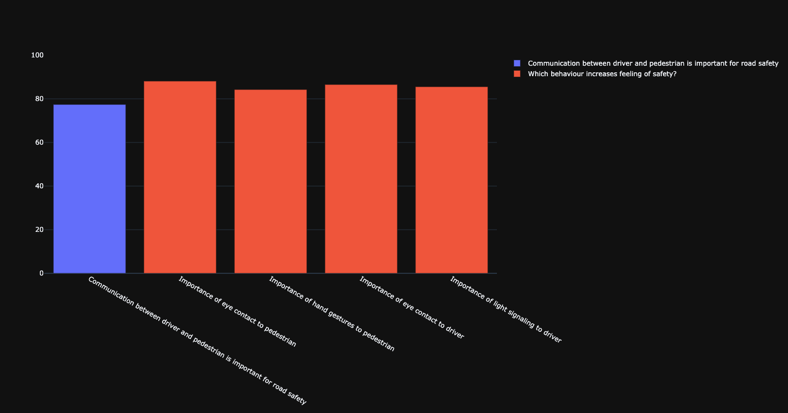](https://htmlpreview.github.io/?https://github.com/bazilinskyy/crossing-crowdsourcing/blob/main/figures/communication.html)  
Communication.

#### Distance to pedestrian
  
Distance to pedestrian over speed for a selected video (video_5).

[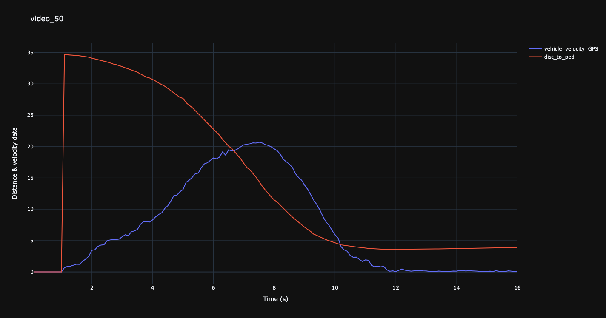](https://htmlpreview.github.io/?https://github.com/bazilinskyy/crossing-crowdsourcing/blob/main/figures/video_data_video_50.html)  
Distance to pedestrian over speed for a selected video (video_50).

#### Risk
  
Risk score for individual videos.

[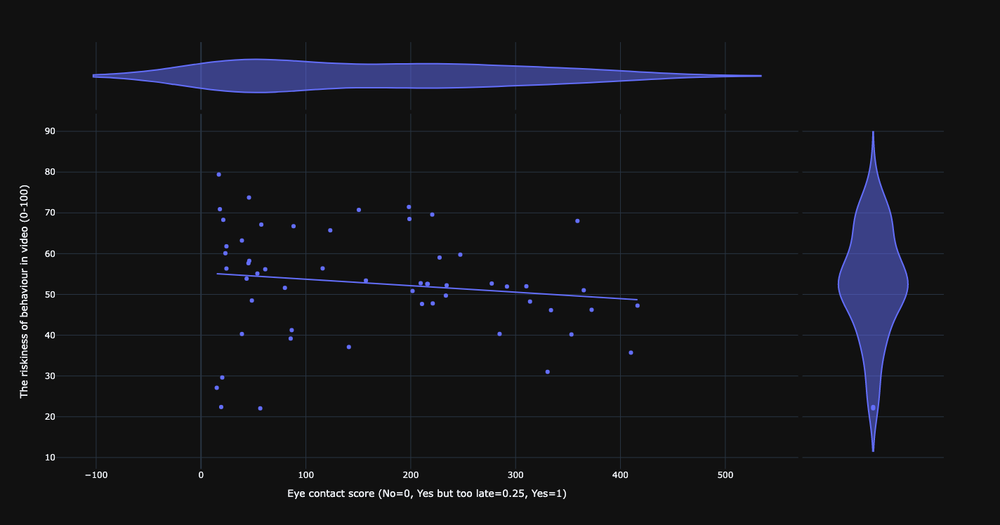](https://htmlpreview.github.io/?https://github.com/bazilinskyy/crossing-crowdsourcing/blob/main/figures/scatter_EC_score-risky_slider.html)  
Relationship between eye contact and risk score.

[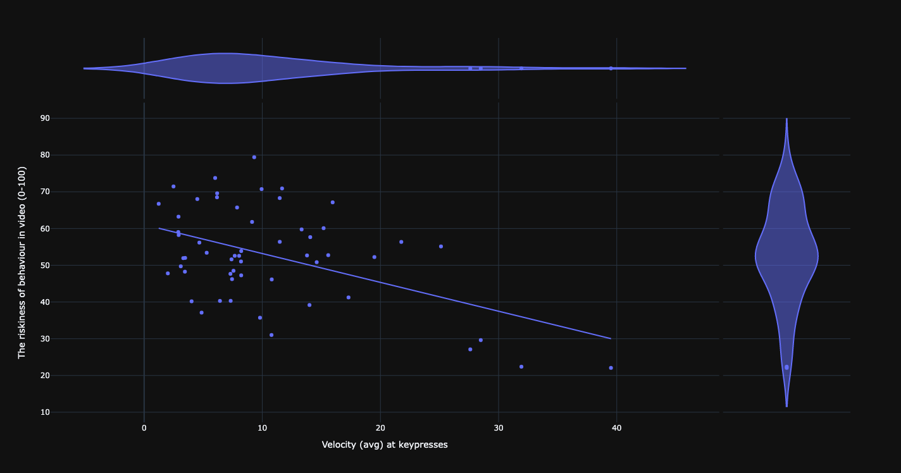](https://htmlpreview.github.io/?https://github.com/bazilinskyy/crossing-crowdsourcing/blob/main/figures/scatter_velocity_risk-risky_slider.html)  
Relationship between car velocity and risk score.

[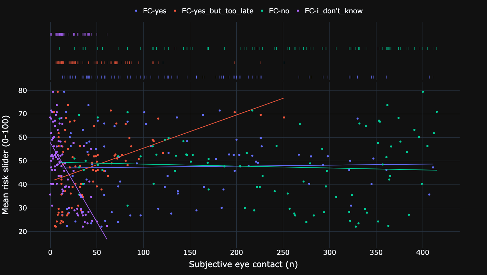](https://htmlpreview.github.io/?https://github.com/bazilinskyy/crossing-crowdsourcing/blob/main/figures/scatter_EC-yes,EC-yes_but_too_late,EC-no,EC-i_don't_know-risky_slider.html)  
Relationship between mean risk and values of subjective eye contact.

[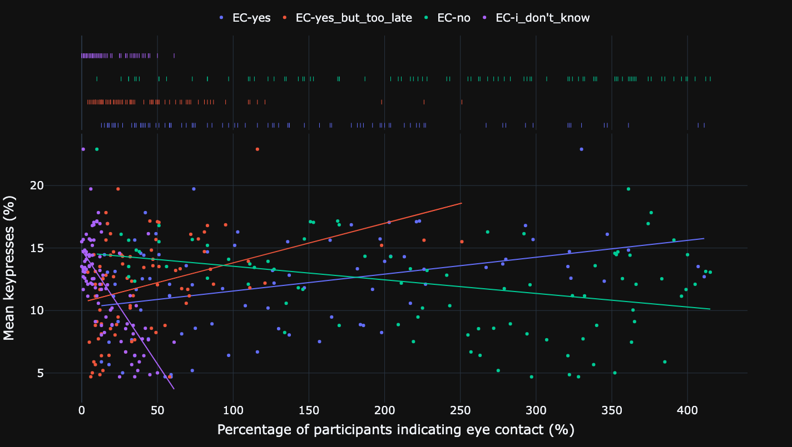](https://htmlpreview.github.io/?https://github.com/bazilinskyy/crossing-crowdsourcing/blob/main/figures/scatter_EC-yes,EC-yes_but_too_late,EC-no,EC-i_don't_know-avg_kp.html)  
Relationship between mean risk and percentage of participants indicating eye contact.

[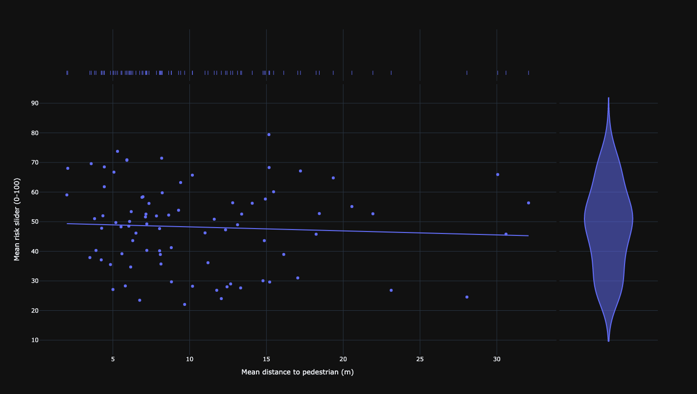](https://htmlpreview.github.io/?https://github.com/bazilinskyy/crossing-crowdsourcing/blob/main/figures/scatter_avg_dist-risky_slider.html)  
Relationship between mean risk and mean distance to pedestrian.

  
Relationship between mean risk and mean distance to pedestrian.

[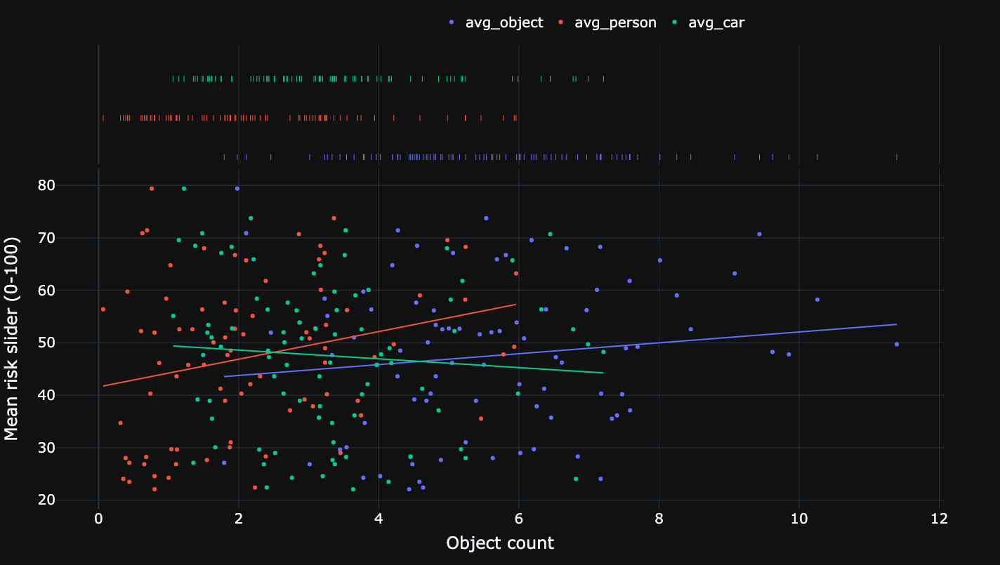](https://htmlpreview.github.io/?https://github.com/bazilinskyy/crossing-crowdsourcing/blob/main/figures/scatter_avg_object,avg_person,avg_car-risky_slider.html)  
Relationship between mean risk and mean number of objects.

[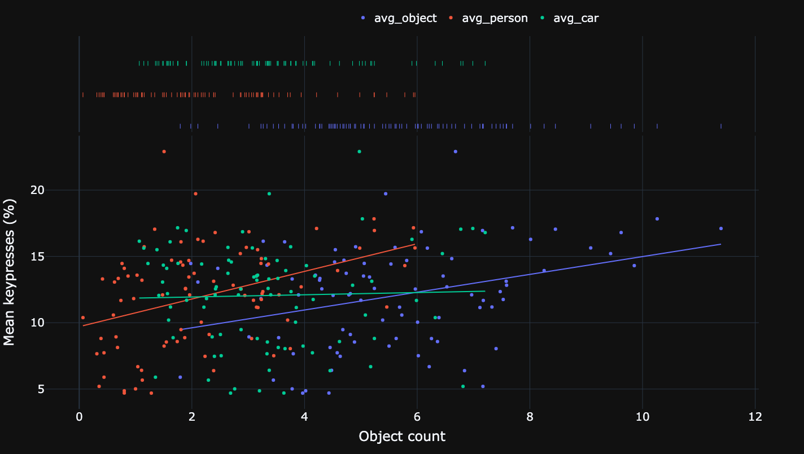](https://htmlpreview.github.io/?https://github.com/bazilinskyy/crossing-crowdsourcing/blob/main/figures/scatter_avg_object,avg_person,avg_car-avg_kp.html)  
Relationship between mean risk and mean keypresses of participants.

[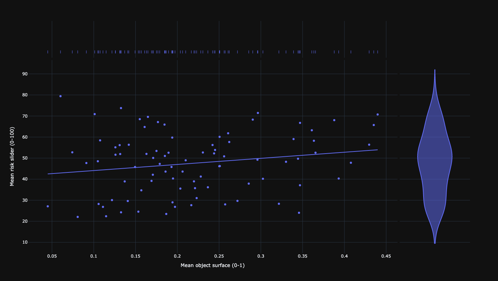](https://htmlpreview.github.io/?https://github.com/bazilinskyy/crossing-crowdsourcing/blob/main/figures/scatter_avg_obj_surface-risky_slider.html)  
Relationship between mean risk and mean surface area of objects.

#### Eye contact
[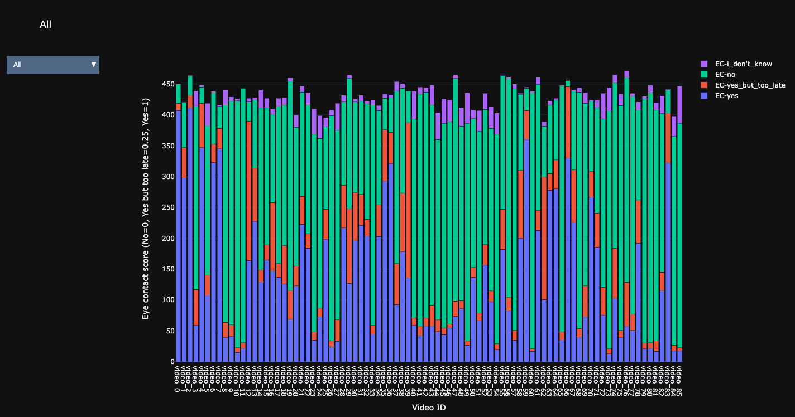](https://htmlpreview.github.io/?https://github.com/bazilinskyy/crossing-crowdsourcing/blob/main/figures/bar_EC-yes-EC-yes_but_too_late-EC-no-EC-i_don't_know_video_0-video_1-video_2-video_3-video_4-video_5-video_6-video_7-video_8-video_9-video_10-video_11-video_12-video_13-video_14-video_15-video.html)  
Eye contact score.

  
Percentage of participants that wrongly indicated looking behaviour.

#### Information on participants
[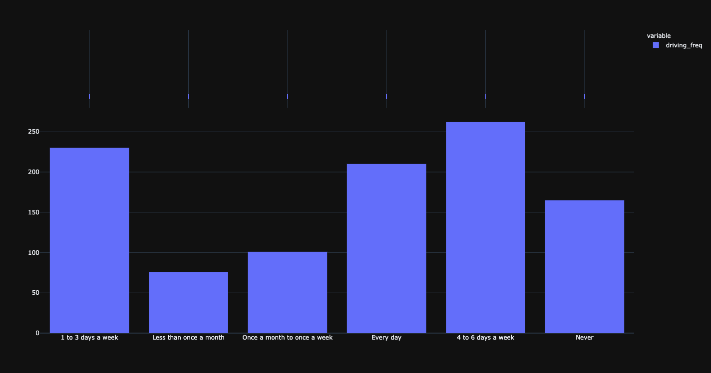](https://htmlpreview.github.io/?https://github.com/bazilinskyy/crossing-crowdsourcing/blob/main/figures/hist_driving_freq.html)  
Driving frequency.

[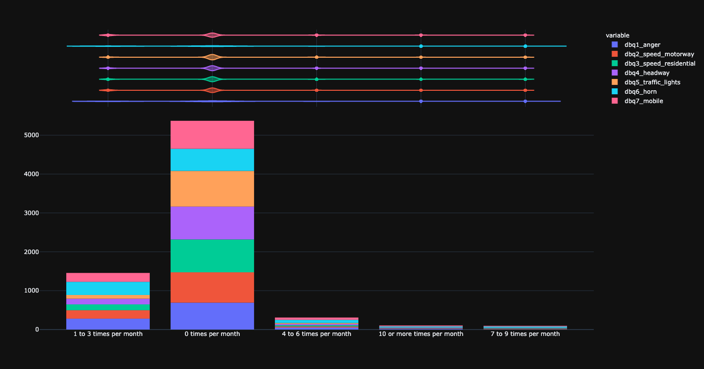](https://htmlpreview.github.io/?https://github.com/bazilinskyy/crossing-crowdsourcing/blob/main/figures/hist_dbq1_anger-dbq2_speed_motorway-dbq3_speed_residential-dbq4_headway-dbq5_traffic_lights-dbq6_horn-dbq7_mobile.html)  
Driving behaviour questionnaire (DBQ).

[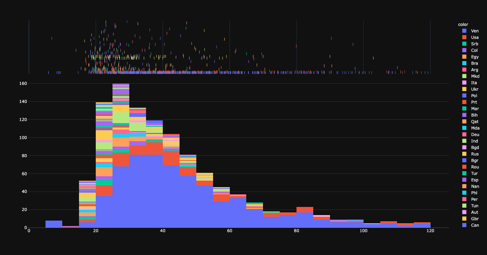](https://htmlpreview.github.io/?https://github.com/bazilinskyy/crossing-crowdsourcing/blob/main/figures/hist_time.html)  
Time of participation.

[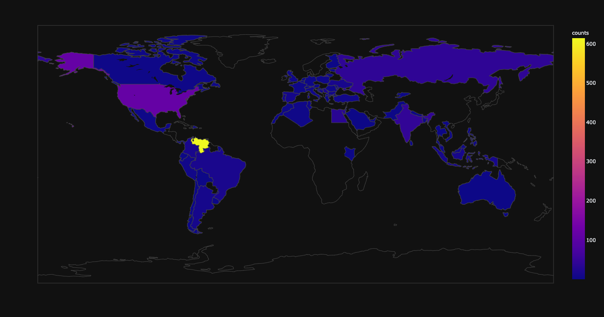](https://htmlpreview.github.io/?https://github.com/bazilinskyy/crossing-crowdsourcing/blob/main/figures/map_counts.html)  
Map of counts of participants.

[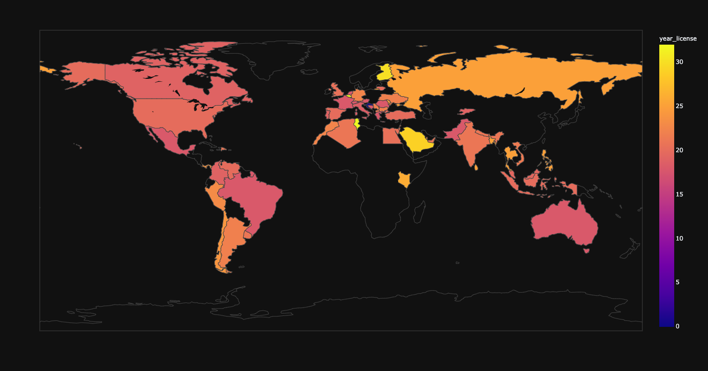](https://htmlpreview.github.io/?https://github.com/bazilinskyy/crossing-crowdsourcing/blob/main/figures/map_year_license.html)  
Map of years of having a license.

[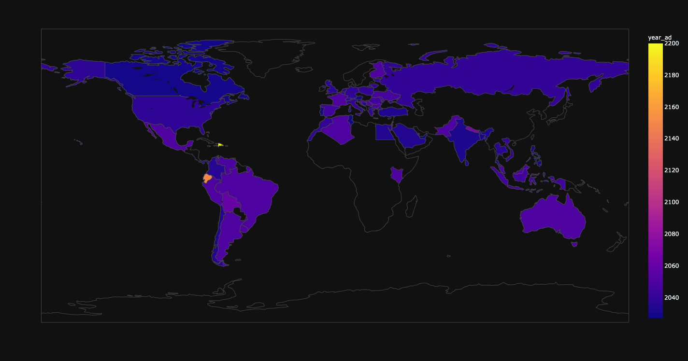](https://htmlpreview.github.io/?https://github.com/bazilinskyy/crossing-crowdsourcing/blob/main/figures/map_year_ad.html)  
Map of prediction of the year of introduction of automated cars in the country of residence.

[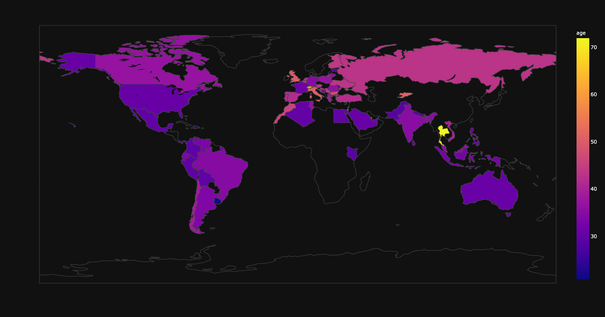](https://htmlpreview.github.io/?https://github.com/bazilinskyy/crossing-crowdsourcing/blob/main/figures/map_age.html)  
Map of age of participants.

[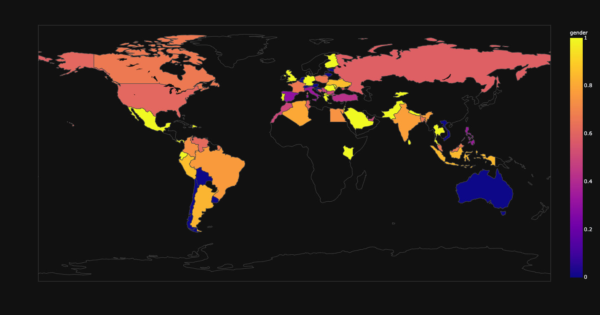](https://htmlpreview.github.io/?https://github.com/bazilinskyy/crossing-crowdsourcing/blob/main/figures/map_gender.html)  
Map of distribution of gender.

#### Technical characteristics of participants
[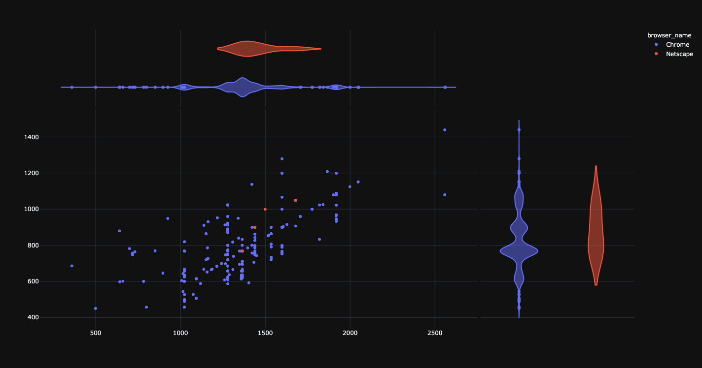](https://htmlpreview.github.io/?https://github.com/bazilinskyy/crossing-crowdsourcing/blob/main/figures/scatter_window_width-window_height.html)  
Dimensions of browser.

### Configuration of analysis
Configuration of analysis needs to be defined in `crossing-crowdsourcing/crossing/config`. Please use the `default.config` file for the required structure of the file. If no custom config file is provided, `default.config` is used. The config file has the following parameters:
* `appen_job`: ID of the appen job.
* `allowed_min_time`: the cut-off for minimal time of participation for filtering.
* `num_stimuli`: number of videos in the study.
* `num_stimuli_participant`: amount of videos each participant watched.
* `num_repeat`: The amount of times the a video was repeated.
* `kp_resolution`: bin size in ms in which data is stored.
* `allowed_stimulus_wrong_duration`: if the percentage of videos with abnormal length is above this value, exclude participant from analysis.
* `allowed_mistakes_signs`: number of allowed mistakes in the questions about traffic signs.
* `sign_answers`: answers to the questions on traffic signs.
* `mask_id`: number for masking worker IDs in appen data.
* `files_heroku`: files with data from heroku.
* `file_appen`: file with data from appen.
* `file_cheaters`: CSV file with cheaters for flagging.
* `path_stimuli`: path consisting of all videos included in the survey.
* `mapping_stimuli`: CSV file that contains all data found in the videos.
* `plotly_template`: template used to make graphs in the analysis.

## Troubleshooting
### Unknown file extension .mp4
If you receive the `ValueError: unknown file extension: .mp4` from `PIL`, install FFMPEG from https://www.ffmpeg.org/download.html. This problem was reported on Windows.
